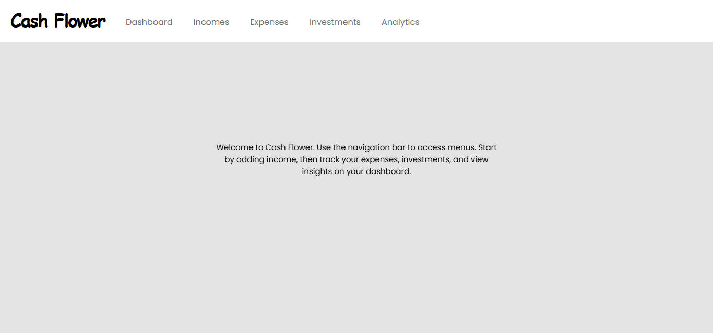
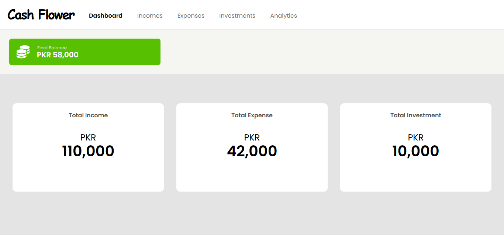
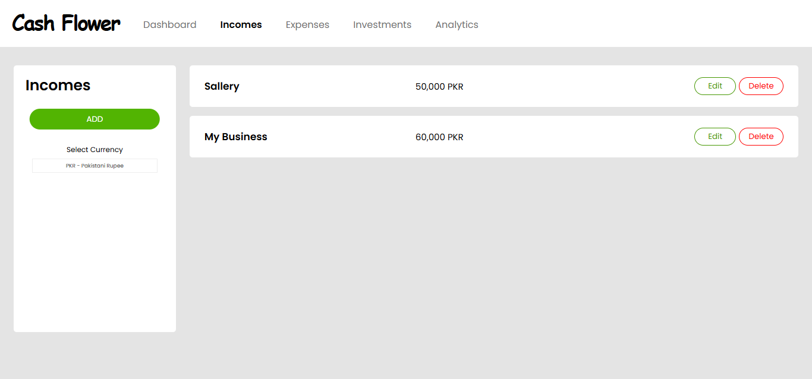
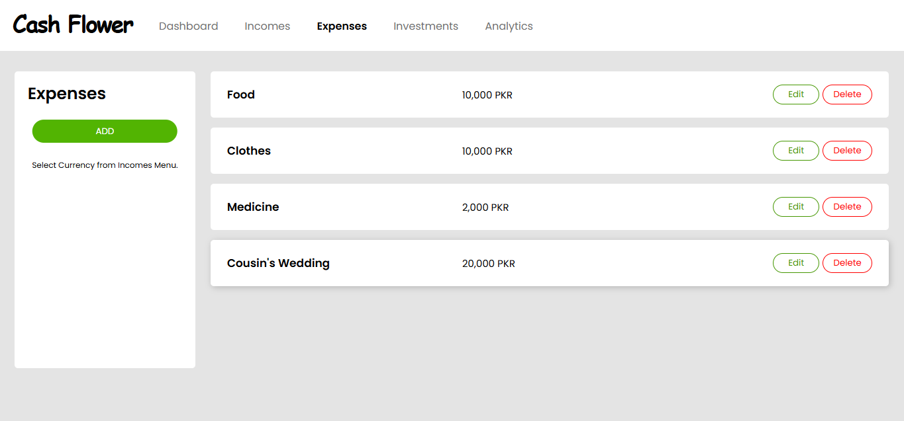
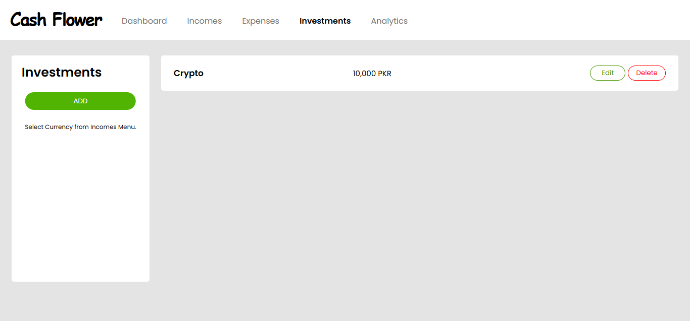
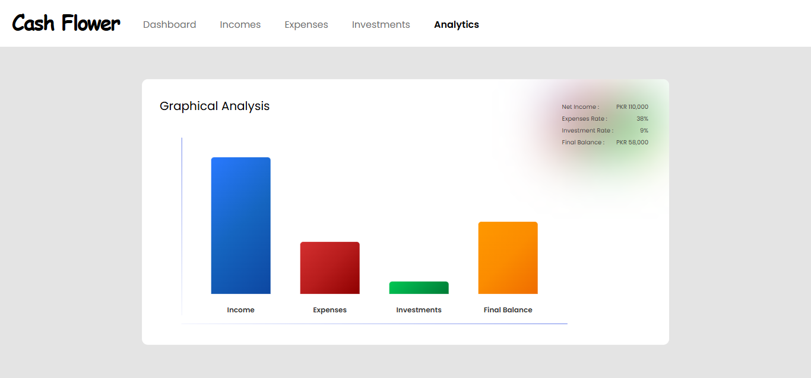

# Personal Finance Tracker

A comprehensive web-based expense tracking application that helps you manage your finances with ease. Built with vanilla JavaScript, HTML, and CSS, this app provides a complete solution for tracking income, expenses, and investments while offering detailed analytics and multi-currency support.

## Screenshot








## Features

- **Multi-Section Navigation**: Dashboard, Income, Expenses, Investments, and Analytics sections
- **Real-time Balance Calculation**: Automatically calculates current balance (Income - Expenses - Investments)
- **Multi-Currency Support**: Choose from a wide range of international currencies with persistent storage
- **Income Management**: Add, edit, and delete multiple income sources with real-time total calculation
- **Expense Tracking**: Comprehensive expense management with category organization
- **Investment Monitoring**: Track investment portfolio and calculate investment rates
- **Visual Analytics**: Interactive bar charts showing financial data comparison
- **Smart Validation**: Input validation ensuring only valid numerical entries
- **Persistent Storage**: All data automatically saved to browser's localStorage
- **Responsive Design**: Works seamlessly across desktop and mobile devices
- **Dynamic Currency Updates**: All amounts automatically update when currency is changed
- **Financial Health Alerts**: Warning notifications when expenses exceed income

## Technologies Used

- HTML5
- CSS3  
- JavaScript (ES6+)
- Local Storage API
- Dynamic DOM Manipulation
- Modular JavaScript Architecture

## Developer's Journey

Here is a detailed look at my journey building this comprehensive finance tracker:

### **Major Learning: The Importance of Frameworks & Libraries**

This project was a real eye-opener about why frameworks and libraries exist and why they're so widely adopted. Building everything from scratch made me realize how much complexity frameworks and libraries handle behind the scenes.

#### **The Reality Check**
What seemed like simple tasks became incredibly complex when done manually:
- **State Management**: Keeping track of which item is being edited across different categories
- **DOM Manipulation**: Creating, updating, and deleting elements while maintaining event listeners
- **Data Binding**: Ensuring UI updates when data changes and vice versa
- **Component Reusability**: Writing similar code for income, expenses, and investments sections

#### **Where I Struggled Without Framework and Libraries Benefits**

**1. State Management Nightmare:**
```javascript
// Manual state tracking - Error prone and hard to maintain
let currentlyEditingSlide = null;
let currentlyEditingName = null;
let currentlyEditingAmount = null;
let currentlyEditingSlideExpenses = null;
let currentlyEditingNameExpenses = null;
let currentlyEditingAmountExpenses = null;
let currentlyEditingSlideInvestments = null;
// ... and so on for each category
```

**2. Repetitive DOM Manipulation:**
```javascript
// Had to write this pattern multiple times for each category
function creatingIncomesSlide() {
    let incomesSlide = document.createElement("div");
    incomesSlide.classList.add("slide");
    let parentOfIncomesSlide = document.querySelector(".incomes-slides");
    parentOfIncomesSlide.appendChild(incomesSlide);
    
    let incomesNameOfActivity = document.createElement("p");
    incomesNameOfActivity.classList.add("name-of-activity");
    
    let incomesAmountOfActivity = document.createElement("p");
    incomesAmountOfActivity.classList.add("amount-of-activity", "incomes-amount");
    
    // ... 50+ more lines of similar code
}

// Similar functions: creatingExpensesSlide(), creatingInvestmentsSlide()
```

**3. Manual Event Listener Management:**
```javascript
// Event listeners had to be manually attached to every dynamically created element
editBtn.addEventListener("click", () => {
    blackOverlay.classList.remove("hide");
    document.querySelector(".edit-incomes-window").classList.remove("hide");
    
    document.querySelector(".input-edit-incomes-window").value = nameElement.textContent;
    let fullText = amountElement.textContent.trim();
    let parts = fullText.split(" ");
    document.querySelector(".amount-edit-incomes-window").value = parts[0].replace(/,/g, "");
    
    currentlyEditingSlide = slide;
    currentlyEditingName = nameElement;
    currentlyEditingAmount = amountElement;
});
```

**4. Data Synchronization Issues:**
```javascript
// Had to manually update multiple places when data changed
function calculatenetIncome() {
    // Calculate total
    netIncome.textContent = total.toLocaleString();
    currencyOfNetIncome.textContent = selectedCurrency;
    saveIncomesToLocalStorage(); // Manual save
    // Then trigger other updates
    remainingAmount();
    barsStatsUpdate();
}
```

#### **What Frameworks and Libraries Would Have Simplified**

**React/Vue Equivalent:**
```javascript
// With React, this entire project could be simplified to:
const [finances, setFinances] = useState({
    incomes: [],
    expenses: [],
    investments: []
});

const [selectedCurrency, setSelectedCurrency] = useState('PKR');

// Automatic re-rendering, state management, and data binding
// No manual DOM manipulation needed
// Component reusability for different categories
```

**The Realization:**
After spending countless hours debugging event listener issues, state synchronization problems, and repetitive code, I understood that:

1. **Frameworks and Libraries save time**: What took me 800+ lines could be done in 200-300 lines with React
2. **Less bugs**: Framework and Libraries patterns prevent common mistakes I made
3. **Better architecture**: Enforced component structure leads to cleaner code
4. **Developer experience**: Hot reloading, debugging tools, and ecosystem support

This project taught me that while vanilla JavaScript is crucial for understanding fundamentals, frameworks exist for good reasons. They're not just "magic" - they solve real problems that every developer faces when building complex applications.

### **Initial Concept & Planning**
I wanted to create a practical tool that would help people manage their personal finances effectively. The goal was to build something more comprehensive than basic expense trackers available online.

### **Architecture Decisions**
- **Modular Approach**: Decided to separate functionality into distinct sections (Dashboard, Income, Expenses, Investments, Analytics)
- **Vanilla JavaScript**: Chose to build without frameworks to strengthen core JavaScript skills
- **Local Storage**: Implemented client-side persistence to avoid backend complexity while ensuring data retention

### **Major Implementation Challenges**

#### **1. Dynamic Currency Management**
One of the biggest hurdles was implementing dynamic currency switching that would:
- Update all existing entries when currency changes
- Maintain proper formatting with thousand separators
- Parse and re-format stored amounts correctly

```javascript
function updateAllCurrencies(){
    let allAmounts = document.querySelectorAll(".amount-of-activity");
    allAmounts.forEach(amountElement => {
        let fullText = amountElement.textContent.trim();
        let parts = fullText.split(" ");
        let numberOnly = parts[0]; 
        let formatted = Number(numberOnly.replace(/,/g, "")).toLocaleString();
        amountElement.textContent = `${formatted} ${selectedCurrency}`;
    });
}
```

#### **2. Local Storage Complexity**
Managing localStorage with dynamic content was challenging:
- **Data Structure**: Had to design JSON structures for each category (incomes, expenses, investments)
- **Load/Save Synchronization**: Ensuring data integrity when loading and saving
- **Currency Persistence**: Maintaining selected currency across sessions

#### **3. Real-time Calculations**
Implementing calculations that update across multiple sections simultaneously:
- Total calculations for each category
- Current balance computation
- Percentage calculations for analytics
- Bar chart height adjustments

#### **4. Dynamic DOM Management**
Creating, editing, and deleting elements dynamically while maintaining event listeners:
- **Edit Functionality**: Implementing edit-in-place for existing entries
- **Event Delegation**: Managing click events for dynamically created buttons
- **State Management**: Tracking which items are currently being edited

```javascript
let currentlyEditingSlide = null;
let currentlyEditingName = null;
let currentlyEditingAmount = null;
```

#### **5. Analytics Visualization**
Building the bar chart system without external libraries:
- **Proportional Scaling**: Making bars scale relative to the highest value
- **Overflow Handling**: Managing extremely large numbers gracefully
- **Responsive Labels**: Showing/hiding labels based on bar size and screen width

### **Problem-Solving Breakthroughs**

#### **Currency Parsing Issue**
Initially struggled with parsing formatted currency strings back to numbers:
```javascript
// Problem: "1,234 USD" -> How to extract just the number?
// Solution: Split by space, take first part, remove commas
let parts = fullText.split(" ");
let numberOnly = parts[0].replace(/,/g, "");
```

#### **Local Storage Data Loss**
Encountered issues where data would disappear on page refresh:
- **Root Cause**: Async loading issues and improper event timing
- **Solution**: Implemented proper DOMContentLoaded event handling and sequential data loading

#### **Performance with Large Numbers**
App would break with very large financial amounts:
- **Problem**: JavaScript precision issues and UI overflow
- **Solution**: Added boundary checks and humorous error messages for unrealistic amounts

```javascript
if(balance > -1e15 && balance <1e15){
   remainingBalance.textContent = `${selectedCurrency} ${balance.toLocaleString()}`;
} else{
   remainingBalance.textContent = `Chawla na maar !!!`
}
```

### **Technical Highlights**

#### **Modular Event Management**
Created separate event handlers for each category while maintaining code reusability:
- Edit/Delete functionality replicated across all categories
- Consistent validation and error handling
- Uniform UI interactions

#### **Smart Data Persistence**
Implemented intelligent localStorage management:
- Automatic saving on every data change
- Graceful handling of corrupted localStorage data
- Currency preference persistence across sessions

#### **Responsive Analytics**
Built a custom bar chart system that:
- Scales dynamically based on data ranges
- Shows/hides labels intelligently
- Handles edge cases like all-zero data


### **Other Lessons Learned**

1. **Planning is Crucial**: Should have planned the data structure more thoroughly before implementation
2. **Error Handling**: Adding comprehensive error handling from the start would have saved debugging time
3. **User Experience**: Small details like loading states and validation messages significantly impact user experience
4. **Code Organization**: As the project grew, better file organization would have helped maintainability

## **Future Enhancements**
- Export functionality (CSV/PDF reports)
- Data backup/restore features  
- Budget goal setting and tracking
- Category-wise expense breakdown
- Monthly/yearly trend analysis
- Dark mode theme option

## File Structure

```
finance-tracker/
├── index.html
├── style.css
├── script.js
├── currencies.js
├── README.md
└── screenshot.png
```

## Browser Compatibility

- Chrome 60+
- Firefox 55+
- Safari 12+
- Edge 79+

## License

This project is open source and available under the [MIT License](LICENSE).